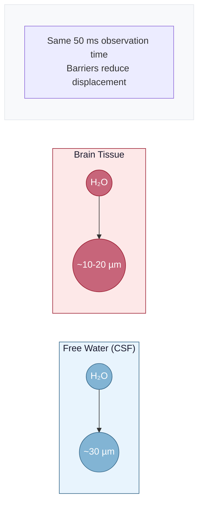
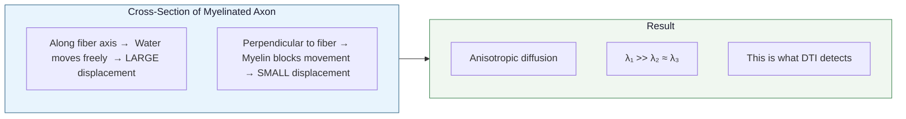
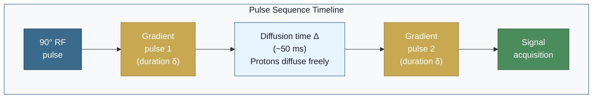
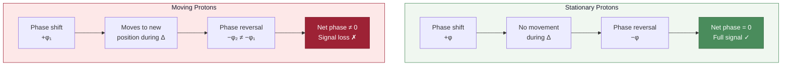
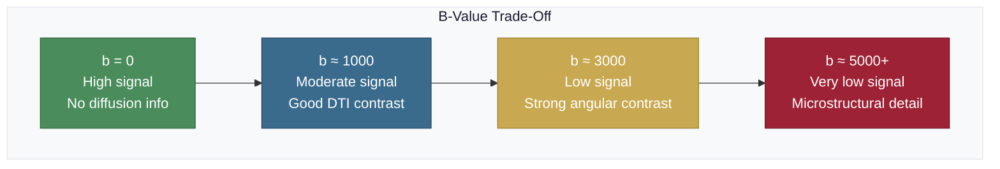
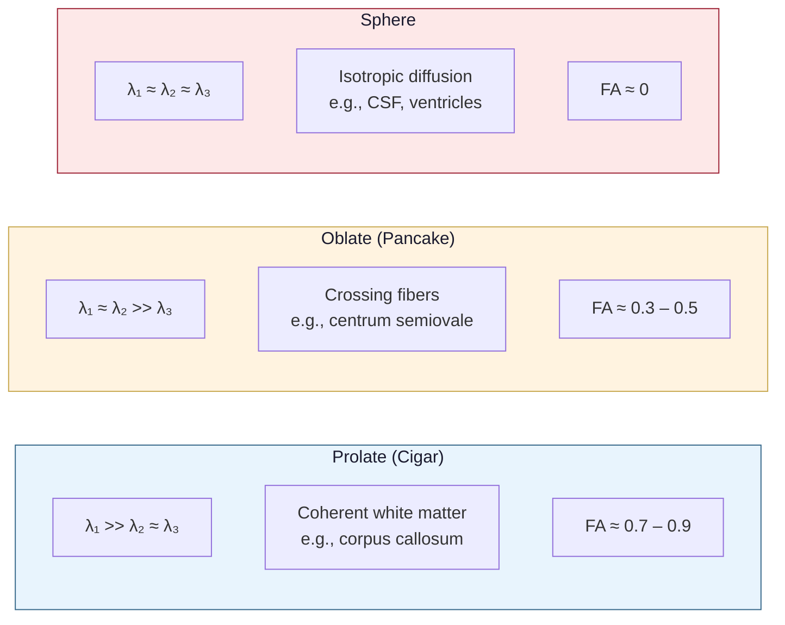
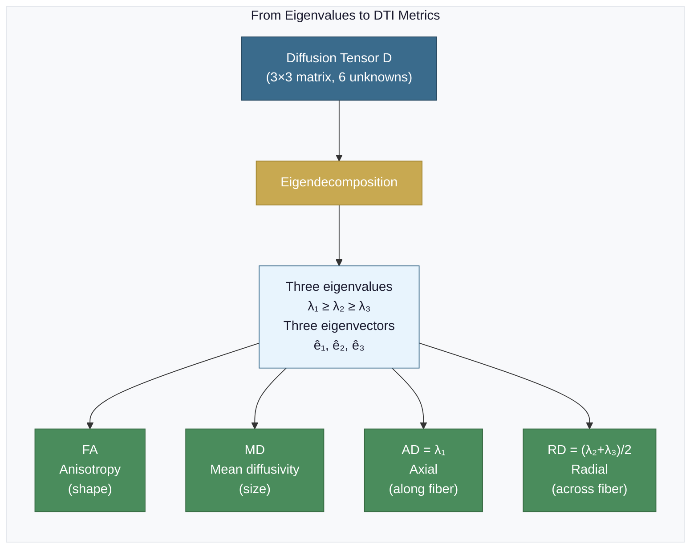
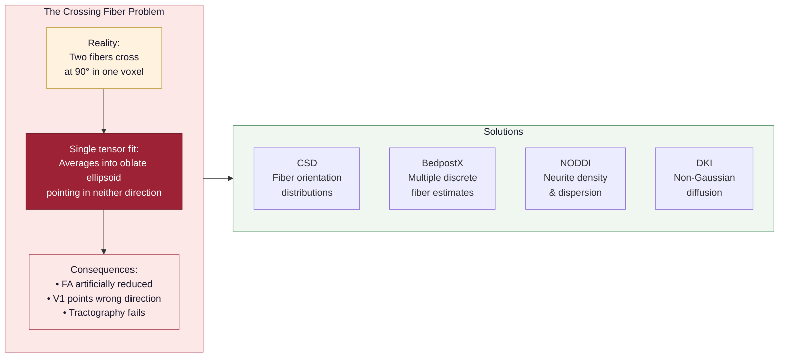
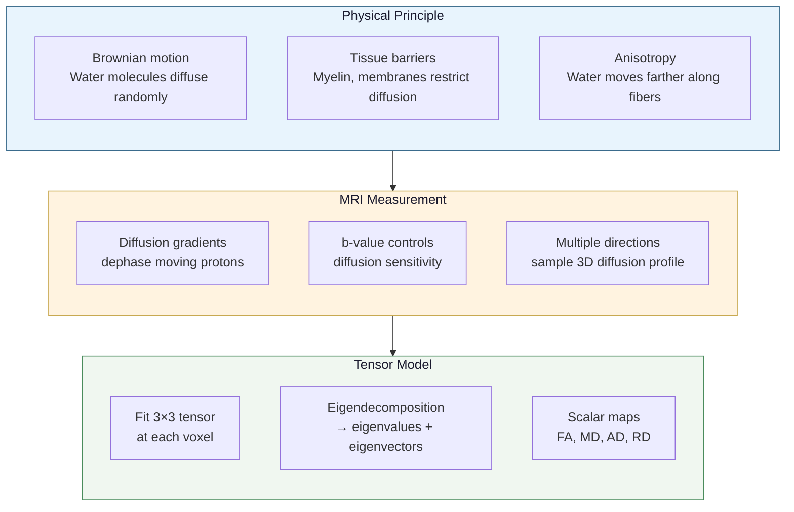

# The Physics of Diffusion MRI

Understanding what your images actually measure helps you make better decisions at every preprocessing step. This page covers the physical principles behind diffusion MRI — from molecular motion to the images on your screen.

## Water Molecules Are Always Moving

Every water molecule in your body is in constant random motion, bouncing off other molecules billions of times per second. This is **Brownian motion**, named after Robert Brown who first observed it in 1827 (though he was watching pollen grains, not water molecules).

In a glass of pure water, this motion is completely random — a molecule is equally likely to move in any direction. Over time, the average displacement of many molecules follows a Gaussian distribution described by the **diffusion coefficient** $D$:

$$
\langle r^2 \rangle = 6Dt
$$

where $\langle r^2 \rangle$ is the mean squared displacement and $t$ is the observation time. For free water at body temperature, $D \approx 3 \times 10^{-3}$ mm$^2$/s, which gives an RMS displacement of about 30 micrometers in 50 ms. In brain tissue, where membranes and myelin restrict movement, the effective diffusion coefficient is much lower ($D \approx 0.7\text{–}1.0 \times 10^{-3}$ mm$^2$/s) and water molecules travel roughly 10–20 micrometers in the same time — about the width of a cell.

## Biological Tissue Restricts Diffusion

In the brain, water is not free. It bumps into cell membranes, myelin sheaths, organelles, and macromolecules. These barriers restrict and hinder water movement, and the pattern of restriction tells us about the underlying tissue architecture.

### Three Types of Diffusion in the Brain

```mermaid
flowchart TD
    subgraph iso["Free (Isotropic)"]
        direction TB
        I["CSF / Ventricles"]
        I1["Water moves equally\nin all directions"]
        I2["D ≈ 3.0 × 10⁻³ mm²/s"]
    end

    subgraph hin["Hindered"]
        direction TB
        H["Extracellular Space"]
        H1["Water moves in all directions\nbut is slowed by obstacles"]
        H2["D reduced by tortuosity"]
    end

    subgraph res["Restricted"]
        direction TB
        R["Inside Axons / Cells"]
        R1["Water is trapped within\nmembranes — moves only\nalong certain directions"]
        R2["D ≈ 0.7-1.0 × 10⁻³ mm²/s"]
    end

    style iso fill:#e8f4fd,stroke:#3A6B8C,color:#1a1a2e
    style hin fill:#fff3e0,stroke:#C8A951,color:#1a1a2e
    style res fill:#fde8e8,stroke:#9D2235,color:#1a1a2e
```

| Type | Where | What Happens |
|------|-------|-------------|
| **Free (isotropic)** | CSF, ventricles | Water moves equally in all directions — no barriers |
| **Hindered** | Extracellular space | Water can move in all directions but is slowed by obstacles |
| **Restricted** | Inside axons, cells | Water is trapped within membranes and can only move along certain directions |

### Why White Matter Is Special

White matter axons are long, thin cylinders wrapped in myelin — a fatty insulating sheath. Water inside an axon can move freely along its length but is blocked from moving perpendicular to it by the myelin membrane. Water between axons is also preferentially channeled along the fiber direction.

This creates **anisotropic diffusion** — water moves farther along the fiber axis than perpendicular to it. This anisotropy is the signal that diffusion tensor imaging exploits.

## How the MRI Scanner Measures Diffusion

A standard MRI scanner measures total signal from hydrogen atoms (protons in water). To make the signal sensitive to diffusion, we add **diffusion-encoding gradients** — brief magnetic field gradients that dephase and rephase the proton spins.

### The Stejskal-Tanner Pulsed Gradient Spin Echo

The classic diffusion-encoding sequence applies two gradient pulses separated by a diffusion time. This is the **Stejskal-Tanner experiment** (Stejskal & Tanner, 1965):

**How it works:**

1. **First gradient pulse** ($\delta$, gradient strength $G$): Applied before the diffusion time. This imparts a position-dependent phase shift to every proton — protons at different locations get different amounts of phase twist.
2. **Diffusion time** ($\Delta \approx 50$ ms): Protons are allowed to diffuse freely.
3. **Second gradient pulse** (identical to the first): Applied after the diffusion time. This reverses the phase shift — but only perfectly for protons that have **not moved**.

Protons that stayed in place get perfectly rephased and contribute full signal. Protons that moved during the diffusion time are imperfectly rephased, causing signal loss. **More movement = more signal loss.**

### The Stejskal-Tanner Equation

This signal attenuation is described mathematically:

$$
S = S_0 \, e^{-b \cdot D}
$$

where:
- $S_0$ is the signal without diffusion weighting (b=0 image)
- $b$ is the **b-value**, which controls how sensitive the measurement is to diffusion
- $D$ is the apparent diffusion coefficient along the gradient direction

The b-value itself is determined by the gradient parameters:

$$
b = \gamma^2 G^2 \delta^2 \left(\Delta - \frac{\delta}{3}\right)
$$

where $\gamma$ is the gyromagnetic ratio, $G$ is the gradient strength, $\delta$ is the gradient pulse duration, and $\Delta$ is the time between the two gradient pulses (Stejskal & Tanner, 1965).

### The b-value

The b-value is the single most important parameter in a diffusion MRI acquisition. It determines how strongly the image is weighted by diffusion:

| b-value (s/mm$^2$) | Sensitivity | Signal Level | Typical Use |
|---------------------|------------|-------------|-------------|
| **0** | None — anatomical image | High | Reference image for normalization |
| **~1000** | Moderate | Medium | Standard DTI — good balance of diffusion contrast and SNR |
| **~2000–3000** | High | Low | Advanced models (CSD, NODDI) — stronger angular contrast |
| **5000+** | Very high | Very low | Specialized microstructural models |

Higher b-values give stronger diffusion weighting (better contrast between different tissue types) but lower signal-to-noise ratio. Most DTI studies use b=1000 s/mm$^2$ as a good compromise.

### Gradient Directions

Each diffusion-weighted volume measures diffusion along one specific direction in 3D space. To fully characterize the 3D diffusion profile at each voxel, you need measurements along multiple directions:

- **Minimum**: 6 non-collinear directions (enough to fit the tensor)
- **Typical**: 30–64 directions (better angular resolution, more robust tensor fit)
- **High angular resolution (HARDI)**: 60–128+ directions (needed for crossing fiber models)

The gradient directions are stored in a `.bvec` file — three rows of numbers specifying the x, y, z components of each gradient direction.

## The Diffusion Tensor

At each voxel, the diffusion tensor is a 3$\times$3 symmetric positive-definite matrix that describes the 3D diffusion profile:

$$
\mathbf{D} = \begin{pmatrix} D_{xx} & D_{xy} & D_{xz} \\ D_{xy} & D_{yy} & D_{yz} \\ D_{xz} & D_{yz} & D_{zz} \end{pmatrix}
$$

This matrix has 6 unique elements (the diagonal plus the three off-diagonal elements), which is why you need at least 6 gradient directions plus a b=0 image to solve for them.

### Eigendecomposition: From Matrix to Meaning

The tensor is decomposed into three **eigenvectors** (directions) and three **eigenvalues** (magnitudes):

- **$\lambda_1$** (largest eigenvalue): Diffusion rate along the principal direction — corresponds to the fiber axis in white matter
- **$\lambda_2$**: Diffusion rate along the second axis
- **$\lambda_3$** (smallest eigenvalue): Diffusion rate along the third axis — perpendicular to the fiber

### Tensor Ellipsoid Shapes

The eigenvectors define the orientation of an ellipsoid that visualizes the diffusion profile. The shape of this ellipsoid tells you about the tissue:

:::info Interpreting Ellipsoid Shape
A **prolate** (cigar-shaped) ellipsoid indicates a single dominant fiber direction — this is what you see in large white matter tracts like the corpus callosum or the corticospinal tract. An **oblate** (pancake-shaped) ellipsoid often indicates fiber crossings where two or more tracts intersect in a voxel. A **spherical** ellipsoid means diffusion is equal in all directions — characteristic of CSF or gray matter.
:::

### Scalar Metrics

From the eigenvalues, we compute the metrics used in most DTI studies:

| Metric | Formula | Interpretation |
|--------|---------|---------------|
| **FA** (Fractional Anisotropy) | $\sqrt{\frac{3}{2}} \frac{\sqrt{(\lambda_1 - \bar{\lambda})^2 + (\lambda_2 - \bar{\lambda})^2 + (\lambda_3 - \bar{\lambda})^2}}{\sqrt{\lambda_1^2 + \lambda_2^2 + \lambda_3^2}}$ | 0 = perfectly isotropic, 1 = perfectly anisotropic |
| **MD** (Mean Diffusivity) | $\frac{\lambda_1 + \lambda_2 + \lambda_3}{3}$ | Average diffusion rate — sensitive to cellularity and edema |
| **AD** (Axial Diffusivity) | $\lambda_1$ | Diffusion along the primary fiber axis |
| **RD** (Radial Diffusivity) | $\frac{\lambda_2 + \lambda_3}{2}$ | Diffusion perpendicular to the fiber axis |

where $\bar{\lambda} = \frac{\lambda_1 + \lambda_2 + \lambda_3}{3}$ is the mean eigenvalue (equal to MD).

:::tip FA Formula Intuition
The FA formula looks intimidating, but the concept is simple: it measures the **variance of the eigenvalues** relative to their magnitude. If all three eigenvalues are equal ($\lambda_1 = \lambda_2 = \lambda_3$), there is zero variance and FA = 0. If one eigenvalue is much larger than the others, the variance is high and FA approaches 1. FA was first defined by Basser & Pierpaoli (1996).
:::

For more on what these metrics mean biologically, see [What is DTI?](./what-is-dti).

## Limitations of the Single-Tensor Model

The diffusion tensor assumes that diffusion at each voxel can be described by a single ellipsoid — one principal fiber direction. This works well in regions with coherently organized fibers (e.g., the corpus callosum).

However, approximately **60–90% of white matter voxels** contain multiple fiber populations — crossing, kissing, or fanning fibers (Jeurissen et al., 2013). In these voxels, the single tensor averages the different fiber orientations into a misleading intermediate direction.

This is why:

- FA is artificially reduced at fiber crossings (the averaging makes the ellipsoid more spherical)
- The principal eigenvector points in a direction that does not correspond to any actual fiber
- Tractography based on the principal eigenvector fails at crossings

Advanced models address this limitation:

| Model | What It Does | Required Data |
|-------|-------------|---------------|
| **CSD** (Constrained Spherical Deconvolution) | Estimates a fiber orientation distribution at each voxel | 1+ shells, many directions |
| **BedpostX** | Estimates multiple discrete fiber orientations with uncertainty | Multi-shell preferred |
| **NODDI** | Models neurite density and orientation dispersion separately | 2+ shells |
| **DKI** (Diffusion Kurtosis Imaging) | Captures non-Gaussian diffusion behavior | 2+ shells |

See [Multi-Shell Analysis](../advanced/multi-shell) for more on these methods.

## Summary: From Physics to Pipeline

## References

- Stejskal EO, Tanner JE (1965). Spin diffusion measurements: Spin echoes in the presence of a time-dependent field gradient. *The Journal of Chemical Physics*, 42(1), 288-292.
- Basser PJ, Mattiello J, LeBihan D (1994). MR diffusion tensor spectroscopy and imaging. *Biophysical Journal*, 66(1), 259-267.
- Basser PJ, Pierpaoli C (1996). Microstructural and physiological features of tissues elucidated by quantitative-diffusion-tensor MRI. *Journal of Magnetic Resonance, Series B*, 111(3), 209-219.
- Le Bihan D, Breton E (1985). Imagerie de diffusion in vivo par résonance magnétique nucléaire. *Comptes Rendus de l'Académie des Sciences, Série II*, 301(15), 1109-1112.
- Jones DK (2010). *Diffusion MRI: Theory, Methods, and Applications*. Oxford University Press.
- Tournier JD, Mori S, Leemans A (2011). Diffusion tensor imaging and beyond. *Magnetic Resonance in Medicine*, 65(6), 1532-1556.
- Jeurissen B, Leemans A, Tournier JD, Jones DK, Sijbers J (2013). Investigating the prevalence of complex fiber configurations in white matter tissue with diffusion magnetic resonance imaging. *Human Brain Mapping*, 34(11), 2747-2766.
