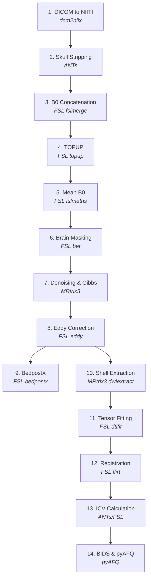

# Pipeline Overview

## Introduction

This pipeline follows the standardized preprocessing flow used across major diffusion MRI projects including the Human Connectome Project (HCP), UK Biobank, and the Adolescent Brain Cognitive Development (ABCD) study. The core stages -- brain extraction, denoising, motion correction, distortion correction, and tensor fitting -- represent the accepted minimum set of operations required to produce reliable diffusion tensor maps from raw scanner data.

**Reference:** Maximov, I.I., Alnaes, D., & Westlye, L.T. (2019). Towards an optimised processing pipeline for diffusion magnetic resonance imaging data: Effects of artefact corrections on diffusion metrics and their age associations in UK Biobank. *Human Brain Mapping*, 40(14), 4146-4162. See also: https://doi.org/10.1016/j.neuroimage.2021.118756

---

## Full Pipeline: 14 Stages

| Stage | Step | Purpose | Tool(s) |
|-------|------|---------|---------|
| 1 | DICOM to NIfTI | Standardize raw scanner data | dcm2niix |
| 2 | Skull Stripping | Remove non-brain tissue | ANTs |
| 3 | B0 Concatenation | Merge AP/PA fieldmaps | FSL |
| 4 | TOPUP | Correct susceptibility distortions | FSL |
| 5 | Mean B0 | Create high-SNR reference image | FSL |
| 6 | Brain Masking | Define analysis region | FSL |
| 7 | Denoising & Gibbs | Remove noise and ringing artifacts | MRtrix3 |
| 8 | Eddy Correction | Correct motion and eddy currents | FSL |
| 9 | BedpostX | Estimate fiber orientations | FSL |
| 10 | Shell Extraction | Isolate b-value shells | MRtrix3 |
| 11 | Tensor Fitting | Compute FA, MD, RD, AD | FSL |
| 12 | Registration | Align to structural/standard space | FSL |
| 13 | ICV Calculation | Estimate intracranial volume | ANTs/FSL |
| 14 | BIDS & pyAFQ | Organize for tractography | pyAFQ |

---

## Pipeline Flowchart



:::note
Stages 9 (BedpostX) and 10-14 branch from stage 8 (Eddy). BedpostX runs independently and does not feed into the tensor fitting pathway.
:::

---

## Why This Specific Pipeline?

### Core Operations (Required)

The following stages are accepted across the field as minimum required operations for diffusion MRI preprocessing:

- **Brain extraction** (Stage 2) -- non-brain tissue introduces artifacts and errors in all downstream steps
- **Susceptibility distortion correction** (Stage 4) -- corrects geometric distortions caused by magnetic field inhomogeneities
- **Denoising** (Stage 7) -- thermal noise degrades tensor estimation, especially at higher b-values
- **Motion and eddy current correction** (Stage 8) -- subject motion and eddy currents cause volume misalignment and signal distortions
- **Tensor fitting** (Stage 11) -- the fundamental computation that produces FA, MD, and other diffusion metrics

### Software-Specific Steps

Some stages exist because of specific software requirements rather than conceptual necessity:

- **B0 concatenation** (Stage 3) -- FSL's `topup` requires AP and PA B0 volumes in a single file
- **Mean B0 creation** (Stage 5) -- averaging multiple B0 volumes produces a higher-SNR reference for brain masking
- **Brain masking** (Stage 6) -- `eddy` requires an explicit brain mask; this refines the initial skull strip

### Processing Standards

This sequence reflects the processing standards established by:

- **Human Connectome Project (HCP)** -- the gold standard for diffusion MRI processing
- **UK Biobank** -- large-scale population imaging with automated preprocessing
- **ABCD Study** -- multi-site developmental neuroimaging with rigorous QC

---

## Manual Pipeline vs QSIPrep

[QSIPrep](../tools/qsiprep.md) is a containerized alternative that automates many of the same preprocessing steps described in this tutorial. It bundles FSL, ANTs, MRtrix3, and other tools into a Docker/Singularity container.

| | Manual Pipeline | QSIPrep |
|---|---|---|
| **Best for** | Learning, custom workflows | Production, reproducibility |
| **Setup** | Install tools individually | Single container |
| **Control** | Full parameter control | Automated defaults |
| **QC** | Manual inspection | Built-in reports |

**Recommendation:** Learn the manual pipeline first to understand what each step does and why. Then consider QSIPrep for production-scale processing. See the full [QSIPrep comparison](../tools/qsiprep.md) for details.

---

## Directory Structure Convention

Organizing outputs into a consistent directory structure makes the pipeline manageable across subjects. The recommended layout:

```
project/
  raw/                    # Raw DICOMs
  NIFTI/                  # Converted NIfTI files
  derivatives/
    ANTs/                 # Skull stripping outputs
    TOPUP/                # Distortion correction
    EDDY/                 # Motion/eddy correction
    DTIFIT/               # Tensor fitting outputs
    FLIRT/                # Registration matrices
    ICV/                  # Intracranial volume
    pyAFQ/                # BIDS-formatted for tractography
  config/                 # Configuration files (acqp.txt, index.txt)
```

Each subject's outputs live within the appropriate derivatives subdirectory. For example:

```
derivatives/
  DTIFIT/
    sub-001/
      sub-001_dtifit_FA.nii.gz
      sub-001_dtifit_MD.nii.gz
      sub-001_dtifit_RD.nii.gz
      sub-001_dtifit_AD.nii.gz
    sub-002/
      ...
```

This structure keeps raw data separate from processed outputs and groups outputs by processing stage, making it straightforward to locate files and run batch operations.

---

## Reference Implementation

The full pipeline described in this tutorial has been implemented and applied in the IMPACT study:

**Repository:** [github.com/DiffusionTensorImaging-Repos/SDN-IMPACT-DTI](https://github.com/DiffusionTensorImaging-Repos/SDN-IMPACT-DTI)

This reference implementation applies all 14 stages to 55 participants with comprehensive quality control at each step. It includes batch processing scripts, configuration files, and QC workflows. Use it as a reference when adapting the pipeline to your own data.

---

## Getting Practice Data

Before diving into the pipeline stages, you will need diffusion MRI data to work with. The [Practice Data](../reference/practice-data) page provides instructions for obtaining sample datasets suitable for working through this tutorial.
